# 📱 Social Media Effects on Mental Health: Advanced Clustering & Analysis

**Vered Shaulov · Elya Davar · Liav Samiya**


This is an unsupervised machine-learning project. It looks at how social media use relates to mental health. We group **5,000 questionnaire responses (3,949 people)** into behavioural profiles using dimensionality reduction (PCA, t-SNE, **NMF**) and clustering (Hierarchical, **Gaussian Mixture Models**). Then we check which lifestyles line up with high stress and anxiety and which line up with healthy habits.

> 📄 **The main deliverables are the [final report](Final%20project%20-%2028.6.26/report/) and the [final presentation](Final%20project%20-%2028.6.26/Presentation/)** in `Final project - 28.6.26/`. This README follows them closely.

---

## 📑 Contents

1. [Key findings at a glance](#-key-findings-at-a-glance)
2. [Motivation and research questions](#-motivation-and-research-questions)
3. [Repository structure](#-repository-structure)
4. [The dataset](#-the-dataset)
5. [Exploratory data analysis](#-exploratory-data-analysis-eda)
6. [Preprocessing and feature engineering](#-preprocessing-and-feature-engineering)
7. [Dimensionality reduction: PCA, t-SNE and NMF](#-dimensionality-reduction-pca-t-sne-and-nmf)
8. [Clustering algorithms](#-clustering-algorithms)
9. [Results and model selection](#-results-and-model-selection)
10. [Cluster interpretation: three user profiles](#-cluster-interpretation-three-user-profiles)
11. [Conclusions, limitations and future work](#-conclusions-limitations-and-future-work)
12. [Project timeline](#-project-timeline)
13. [How to run](#-how-to-run)
14. [תקציר בעברית](#-תקציר-בעברית)

---

## 🎯 Key findings at a glance

**Final model:** NMF (3 components), then a GMM with spherical covariance and **K = 3**. Silhouette score ≈ **0.50**.

| Metric | 🟦 Utility User (cluster 1) | 🟥 Heavy Social User (cluster 2) | 🟩 Healthy Low-Digital (cluster 3) |
|---|---|---|---|
| Average age | 25 | 24 | 48 |
| Total screen time | 380 min | 390 min | 210 min |
| Social media time | 140 min | 240 min | 100 min |
| Stress / Anxiety | 6.1 / 2.1 | **8.0 / 3.1** | 5.1 / 1.7 |
| Primary platforms | WhatsApp, Facebook, Twitter | TikTok, YouTube, Instagram, Snapchat | All platforms |

*Source: the summary table in the final report and final presentation.*

1. **Screen time vs. mental strain.** Heavy daily screen time is clearly and positively linked to higher anxiety and stress.
2. **Platform design matters as much as screen time.** Visual, algorithm-driven platforms (TikTok, Instagram) go with the highest stress and anxiety. Users of functional apps (WhatsApp) sleep better and are more physically active.
3. **Age.** Older users have much lower mental strain, better offline habits and less screen time.

---

## 💡 Motivation and research questions

**Why this topic?** All three of us use social media every day, and we wanted to know whether our own habits have a measurable psychological cost. The topic is also very current:
- In the US, courts have ruled against social media companies. One example is the first wave of social-media-addiction lawsuits, where a jury found Meta's platforms harmful to children. Several countries, from Australia to Europe, are moving to limit children's access to social media.
- The **World Happiness Report** (PISA 2022 data) and recent digital well-being studies keep linking rising social media use to worse mental health, especially among young people.

**Project questions**
1. Is more screen time linked to high-risk mental states?
2. Do negative online interactions affect mood and sleep?
3. How do people group together by screen engagement and mental state across different ages?
4. ⭐ **Main question:** Is a person's main social media platform, together with their age, linked to their anxiety or stress level?

**Hypothesis:** the choice of main platform and the intensity of screen use are directly linked to high-risk mental states and severe sleep disruption.

**Why clustering?** Traditional statistics test variables one pair at a time (for example, only screen time against sleep). That misses how a person's whole lifestyle fits together. Clustering looks at **all 15 behavioural and psychological features at once**. It finds natural, data-driven groups instead of forcing people into pre-defined categories. A probabilistic method (GMM) also allows for the soft, overlapping boundaries that real human behaviour has.

---

## 🗂 Repository structure

The folders match the project's Google Drive folder. **All files are the originals and unchanged.** Google Docs and Sheets were exported with Google's own export.

```
📁 Final project - 28.6.26/          ⭐ FINAL DELIVERABLES
   📁 report/
      עותק של Report.pdf             Final written report (18 pages)
   📁 Presentation/
      מצגת סופית.pptx                Final presentation (52 slides)

📁 clustering-7.6.26/                Clustering milestone (second meeting, 7.6.26)
   Clustering.ipynb                  Main notebook: normalise → encode → reduce → cluster → profile
   Clustering.pdf                    Printout of the notebook with all outputs and plots
   second meeting.pptx               Second-meeting slides (Manual vs PCA-2, Hierarchical vs GMM)
   עותק של CLUSTERING.docx / .pdf    Written answers: clustering theory + project analysis

📁 The data set/
   עותק של הdata שבחרנו (3).xlsx     The chosen dataset: 3 tabs, formulas kept
   📁 csv-export/
      original (מקורי).csv            Tab 1: raw data, 5,000 rows × 15 columns
      final (סופי).csv                Tab 2: cleaned data + engineered features (the input for the notebook)
      with formulas (כולל נוסחאות).csv  Tab 3: same as Tab 2 plus the duplicate-name helper columns

📁 docs/figures/                     Charts taken from the report and presentation (used in this README)
```

> The Drive folders `eda-17.5.26/` and `Final project - 28.6.26/code/` were empty, so they are not in the repository.

---

## 📊 The dataset

| | |
|---|---|
| **5,000** questionnaire rows | **15** original features |
| **3,949** different people | **2 years** (2024–2025) |
| **7** platforms: Facebook, Instagram, TikTok, WhatsApp, YouTube, Twitter, Snapchat | |

Each row is one questionnaire, filled in by one person on one date. It covers their phone and social media use and their physical and mental health.

<details>
<summary><b>Feature dictionary (click to expand)</b></summary>

| Feature | Description |
|---|---|
| `person_name` | Name of the user |
| `age` | Age of the user |
| `date` | Date the data was recorded |
| `gender` | Male / Female / Other |
| `platform` | Main social media platform |
| `daily_screen_time_min` | Total daily device screen time (minutes) |
| `social_media_time_min` | Daily time on social media (minutes) |
| `negative_interactions_count` | Negative / harmful interactions experienced online |
| `positive_interactions_count` | Positive interactions experienced online |
| `sleep_hours` | Hours of sleep per day |
| `physical_activity_min` | Daily physical activity (minutes) |
| `anxiety_level` | Self-reported anxiety score |
| `stress_level` | Self-reported stress score |
| `mood_level` | Self-reported mood score |
| `mental_state` | Label given by the examiner: Healthy / Stressed / At_Risk |

**Derived columns** (in the `final` tab): `row_ID`, `person_ID`, `daily_screen_time_without_social_media_min`, `social_media_ratio`, `activity_to_screen_ratio`.
</details>

**Limitation: very unbalanced classes.** 92.02% of users are *Stressed*, 6.82% *Healthy* and only 1.16% *At_Risk*. Clustering algorithms tend to follow the majority class, so the smaller groups are harder to separate.

---

## 🔍 Exploratory data analysis (EDA)

- **Scales differ a lot.** Time features run to hundreds of minutes, while psychological scores are on a 1–10 scale.
- **Clean data.** There are no missing values, nulls or typos. We first planned to add about 5% artificial noise (missing values, typos, extreme outliers) to imitate messy real-world data. ❌ We dropped that idea. ✅ We kept the original clean data so the real statistical patterns stay intact.
- **Gender is close to even:** 49.48% Female, 48.54% Male.

<p align="center">
  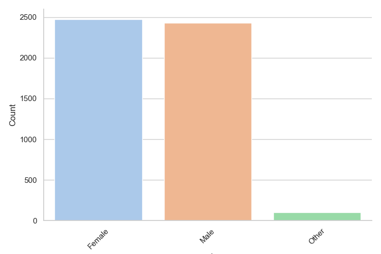
  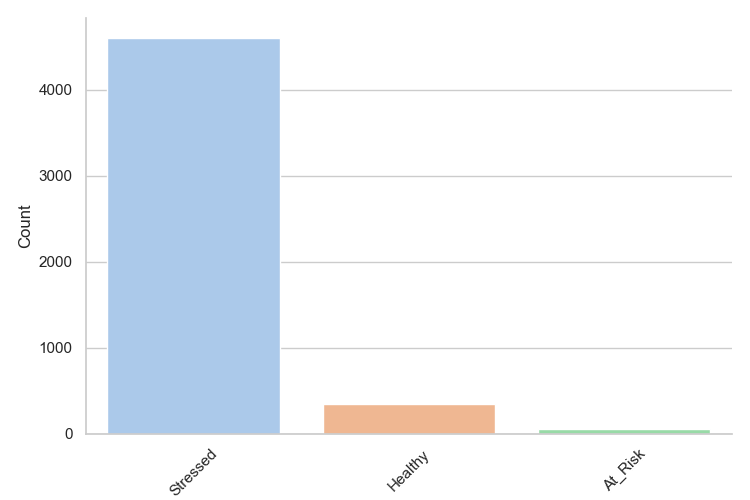
</p>

**Strong correlations found before clustering**

| Pair | Correlation |
|---|---|
| Age ↔ Daily screen time | **−0.87** (younger people spend much more time on screens) |
| Negative interactions ↔ Anxiety | **+0.81** |
| Sleep hours ↔ Mood | **+0.69** |
| Daily screen time ↔ Anxiety | **+0.63** |

<p align="center">
  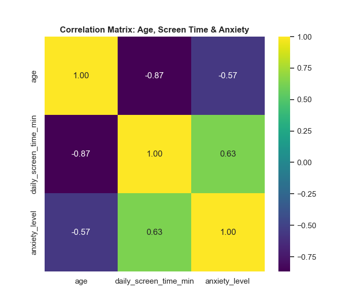
  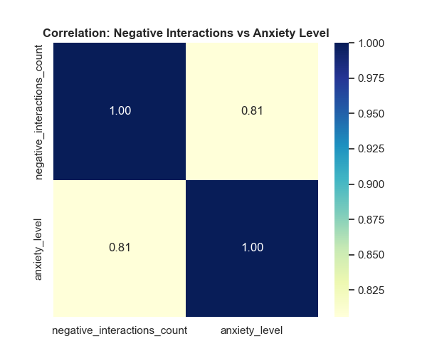
  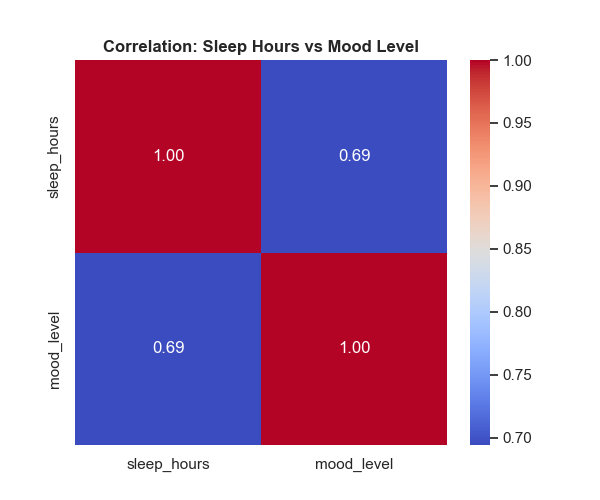
</p>

---

## 🛠 Preprocessing and feature engineering

| Step | What we did | Why |
|---|---|---|
| **Ordinal encoding** | `mental_state`: Healthy = 0, Stressed = 1, At_Risk = 2 | Keeps the natural order of severity |
| **One-hot encoding** | `platform`, `gender` | Stops the models from assuming a false numeric order |
| **Min-Max scaling** | All numeric features scaled to [0, 1] | Stops large features (minutes) from dominating the distances. It also keeps all values non-negative, which NMF needs |
| **Ratio features** | `social_media_ratio`, `activity_to_screen_ratio`, `daily_screen_time_without_social_media_min` | Capture relative behaviour, not just absolute minutes |
| **Unique person ID** | Rows with the same name were grouped, allowing a ±1-year age difference | Different people can share a name. This showed the 5,000 rows come from **3,949 people** |

---

## 📉 Dimensionality reduction: PCA, t-SNE and NMF

Reducing dimensions removes noise, deals with features that move together (such as stress, anxiety and mood), and boils the data down to its main behavioural patterns before clustering.

### PCA (Principal Component Analysis) with 7 components
**7 components keep more than 90% of the variance.**

<p align="center">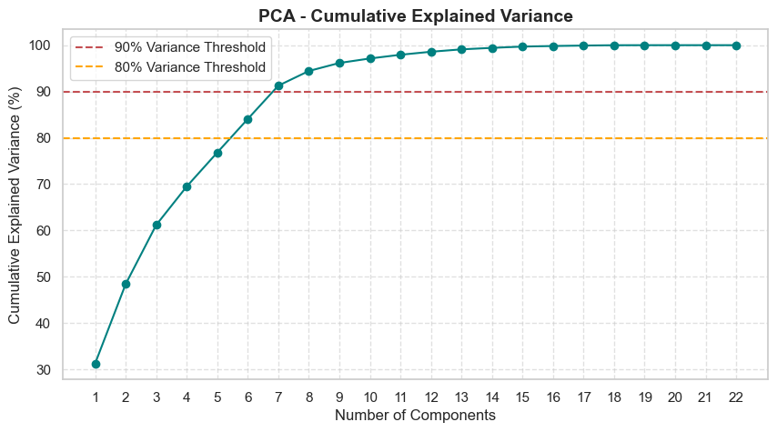</p>

On 7 components, the elbow method suggested K = 7. The silhouette search chose **GMM (full covariance, K = 8, ≈ 0.37)** and **Hierarchical (average linkage, K = 6, ≈ 0.33)**.

<p align="center">
  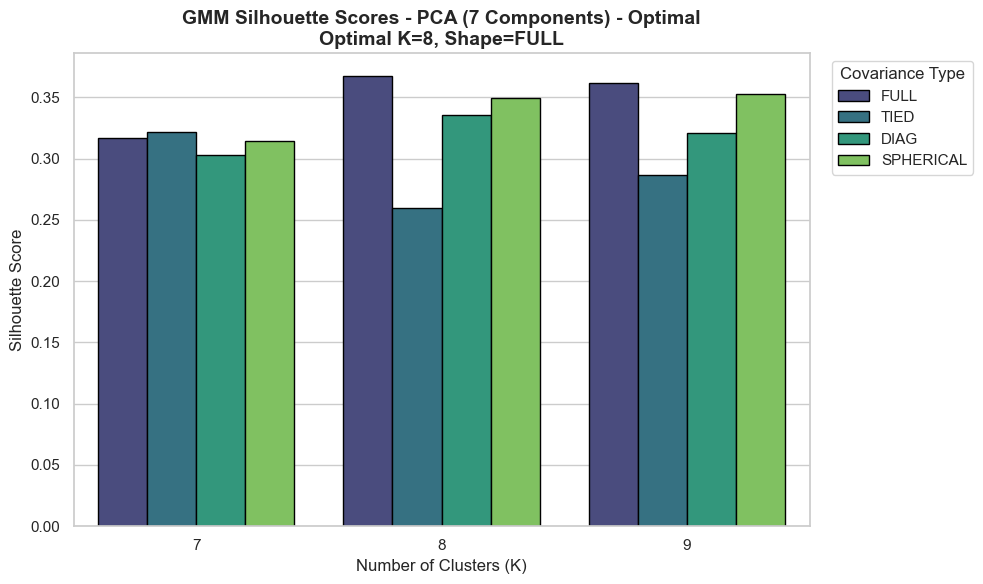
  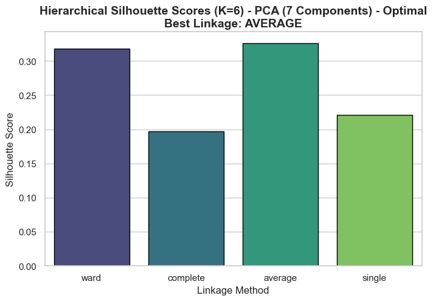
</p>
<p align="center">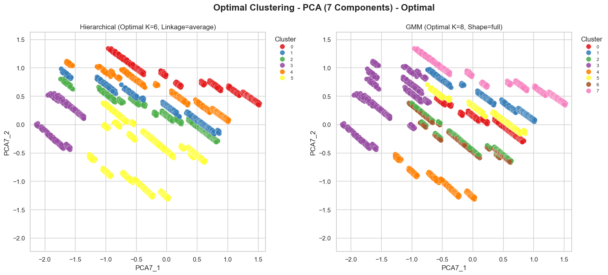</p>

**PCA: quality over quantity.** We dropped the 7-component version for three reasons:
- **Hard to visualise.** 7 dimensions can't be shown clearly in 3D, so the clusters can't be checked by eye.
- **Overfits the categories.** The clusters split users mainly by the one-hot *platform* columns instead of by actual behaviour.
- **3 components focus on behaviour.** Squeezing the data into 3 dimensions filters out that noise and shows the real patterns of digital habits and mental strain.

### PCA with 3 components
Here the elbow method gave K = 4. **GMM (spherical, K = 4) scored ≈ 0.35** and Hierarchical (Ward) scored ≈ 0.31. Both models found almost the same clusters, so we continued with **GMM only**. Its probabilistic boundaries describe changing human behaviour better.

<p align="center">
  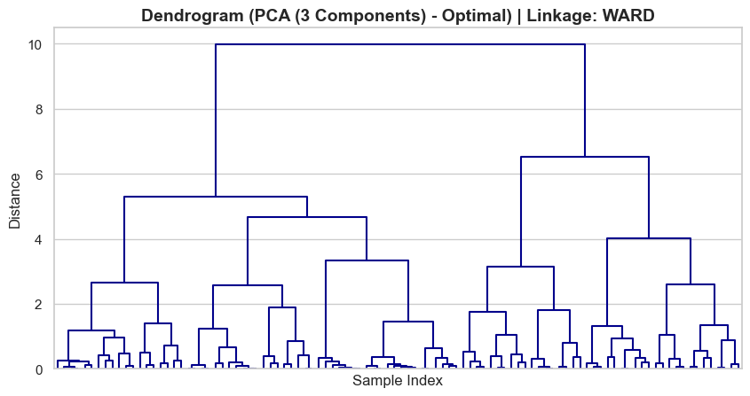
  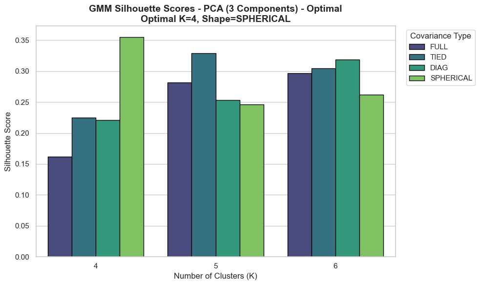
</p>

### t-SNE
t-SNE is a non-linear method. It turns distances between points into probabilities of being neighbours.
➕ It is very good at keeping local clusters together and showing clear boundaries. ➖ It distorts the global layout, so it can't be used as a preprocessing step for clustering.
We tried perplexity values of **5, 30 and 50** (GMM, K = 3) to look at both local and global structure.

<p align="center">
  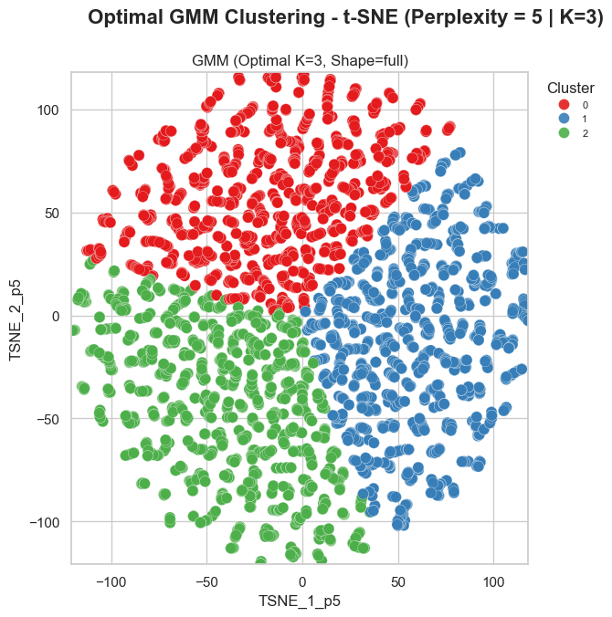
  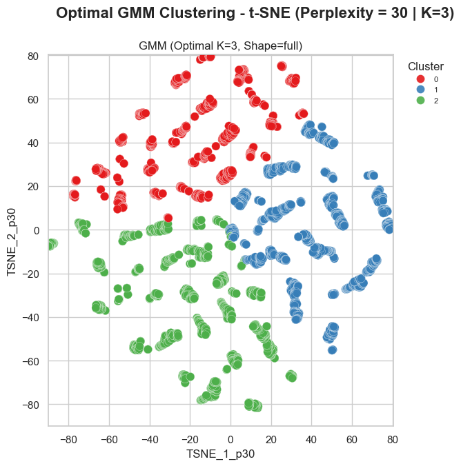
  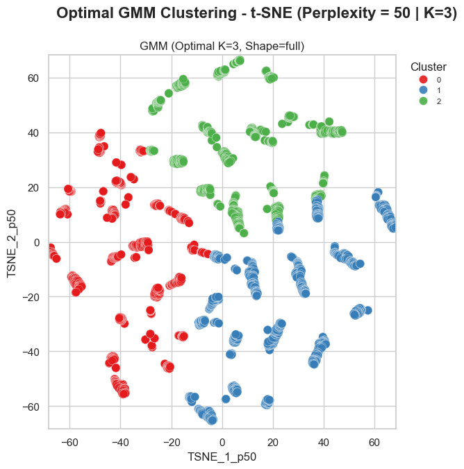
</p>

### ⭐ NMF (Non-Negative Matrix Factorization), the chosen representation
PCA allows negative loadings and forces the components to be orthogonal. **NMF uses only positive, additive weights.** Our scaled data is all non-negative, so NMF naturally groups features into meaningful *parts* that read as real user profiles rather than abstract mathematical axes.

**Parameters:** `n_components=3, init='random', random_state=42, max_iter=500`. The elbow method gave K = 3, the point where the curve bends most sharply.

| Component | Meaning | Top weights |
|---|---|---|
| **NMF1** | The *Stressed social media user* | mental_state (0.83), social_media_ratio (0.77), anxiety_level (0.75) |
| **NMF2** | The *Healthy / active user* | sleep_hours (0.80), physical_activity (0.80), mood_level (0.74) |
| **NMF3** | The *General screen user* | mental_state (0.91), daily_screen_time_w/o_social_media (0.76) |

<p align="center">
  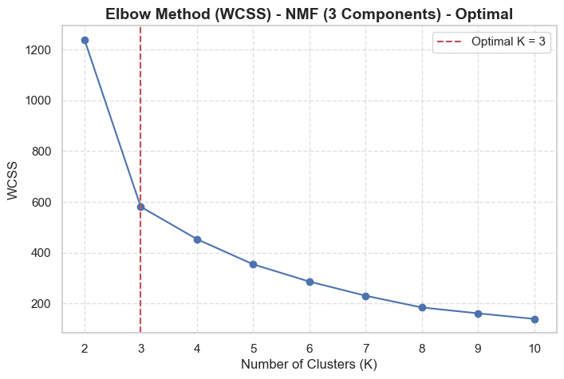
  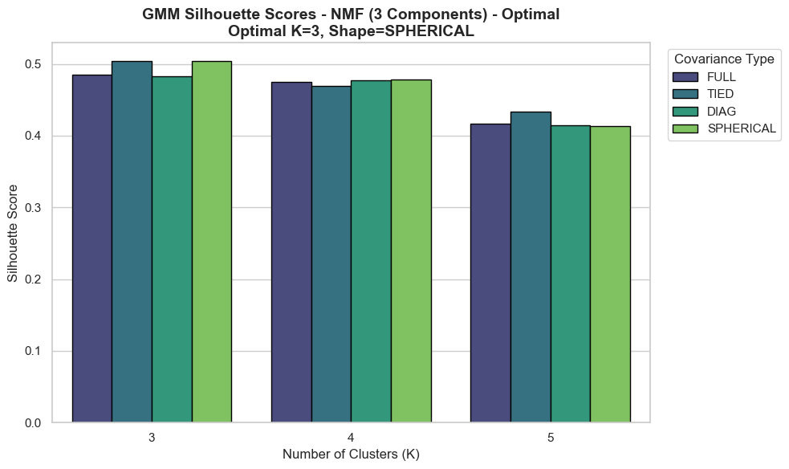
</p>

**NMF advantages and limitations**
- ➕ The data is split into readable parts, giving clear profiles to feed into the GMM. Psychological-distress variables end up separate from healthy habits.
- ➖ The input must be non-negative, so Min-Max scaling is required. The components are not forced to be orthogonal, so they can overlap and correlate.

---

## 🧩 Clustering algorithms

| | Hierarchical (Agglomerative) | Gaussian Mixture Model (GMM) ✅ |
|---|---|---|
| **Idea** | Starts with every point as its own cluster and keeps merging the two closest clusters. This builds a tree (a **dendrogram**) | Treats the data as a weighted sum of **K Gaussians**, each with its own mean and covariance. Fitted with **Expectation-Maximisation (EM)** |
| **Assignment** | Hard and deterministic | **Soft and probabilistic**: each point gets a probability for every cluster |
| **Hyperparameters** | `n_clusters`, `linkage` (ward / complete / average / single), `metric` | `n_components`, `covariance_type` (full / tied / diag / spherical), `n_init` |
| ➕ Pros | Transparent and easy to read (dendrogram). Good for sharp group boundaries | Flexible cluster shapes. Soft assignments suit overlapping human behaviour |
| ➖ Cons | Scales poorly (O(n² log n)). Merges can't be undone. No built-in handling of noise or outliers | Assumes roughly Gaussian clusters. Sensitive to initialisation and local optima. A full covariance can overfit |

**Choosing K (a strict, step-by-step process)**
1. **Elbow method.** Run K-Means for K = 2…10 and compute the WCSS (within-cluster sum of squares). The elbow is found objectively as the point on the curve farthest from the straight line joining its two ends.
2. **Silhouette validation.** Test the base K, K+1 and K+2 across all covariance types (GMM) or linkage methods (Hierarchical), and keep the most cohesive setup.

**Final choice: GMM.** Mental health and digital habits don't have sharp boundaries. GMM's soft assignments allow a more nuanced breakdown, for example a user who is both active *and* highly stressed.

---

## 🏆 Results and model selection

| Representation | Model | Best K | Silhouette |
|---|---|---|---|
| PCA, 7 components | Hierarchical (average) | 6 | ≈ 0.33 |
| PCA, 7 components | GMM (full) | 8 | ≈ 0.37 |
| PCA, 3 components | Hierarchical (Ward) | 4 | ≈ 0.31 |
| PCA, 3 components | GMM (spherical) | 4 | ≈ 0.35 |
| **NMF, 3 components** | **GMM (spherical)** | **3** | **≈ 0.50** ✅ |

### PCA vs. NMF (GMM, K = 3)
<p align="center">
  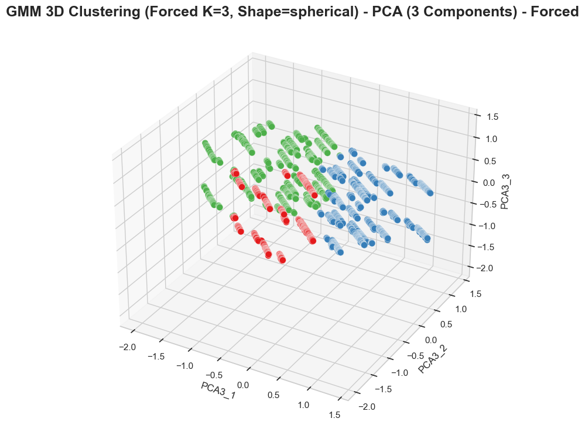
  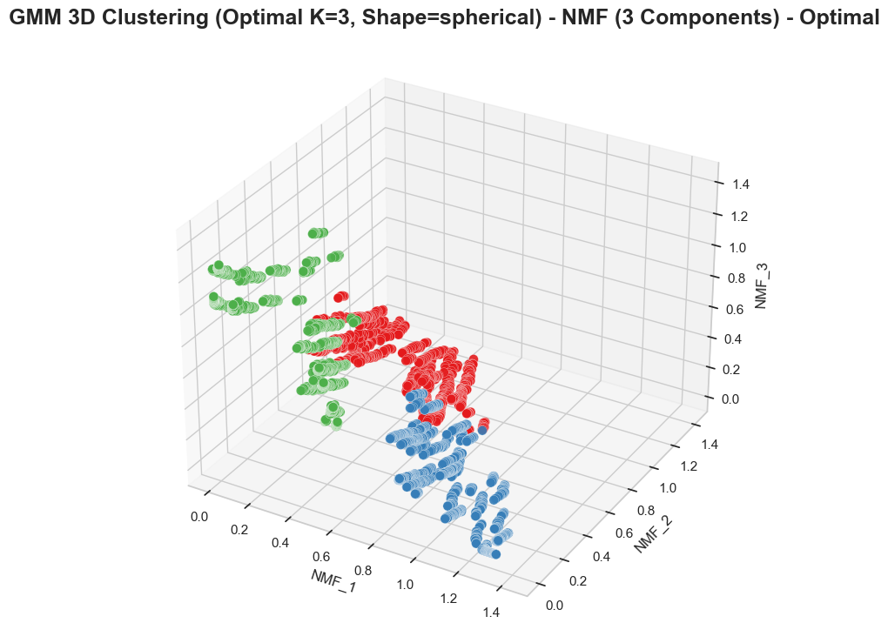
</p>

- **The core clusters are the same.** PCA and NMF gave very similar results at K = 3, with only small differences in the platform mix.
- **Non-negativity fits the data.** Screen time, age and interaction counts can never be negative, and NMF uses only positive values.
- **Profiles are easy to read.** Because NMF only adds parts together, it builds "pure" user profiles instead of abstract components, which makes the groups much easier to interpret.

> The manual reduction (`Digital_Habits_Index` + `Mental_Strain_Index` + platform columns) got the highest silhouette numbers. However, it builds our own assumptions into the structure and risks human bias. **NMF + GMM gave the most meaningful and usable profiles.**

---

## 👥 Cluster interpretation: three user profiles

### 🟦 Cluster 1: The "Utility Screen" user (moderate strain)
- Young (average age about 25), low physical activity (about 18 min/day), average sleep (about 7 h).
- **Very high screen time (about 380 min/day) but relatively little social media (about 140 min).** This is the biggest gap between total and social screen time: roughly 280 minutes a day of screen use is not social.
- Middle-range scores: stress about 6.1, anxiety about 2.1, mood about 5.2. Mostly communication and information apps (WhatsApp, Twitter).
- 💬 *This is the modern "digital worker" or "utility scroller". Their screen time comes from work and daily life. They feel ordinary modern stress, but because they are not tied to algorithm-driven feeds, they avoid the extreme anxiety of heavy social media users.*

### 🟥 Cluster 2: The "Heavy Social Media" user (high psychological strain)
- Young (average age about 24), low physical activity, average sleep.
- **The most screen time (about 390 min/day), mostly on social media (about 240 min).**
- **The worst mental scores:** highest stress (about 8.0), highest anxiety (about 3.1), lowest mood (about 5.1).
- Prefers short, visual platforms: TikTok, Snapchat, Instagram, YouTube.
- Very volatile online: the **most positive *and* negative interactions** of any group. Almost 100% are labelled *Stressed*.
- 💬 *This group matches the central idea of digital-wellness research: heavy use of highly engaging visual social media goes with severe mental strain, a volatile online life and higher anxiety.*

### 🟩 Cluster 3: The "Healthy, Low-Digital" user (low strain)
- **Much older (average age about 48).** The best offline habits: the most physical activity (about 39 min/day) and the most sleep (about 8 h).
- The least screen time (about 210 min) and the least social media (about 100 min).
- **The best mental profile:** lowest anxiety (about 1.7), lowest stress (about 5.1), highest mood (about 6.4). The report highlights a preference for Facebook.
- The fewest online interactions. It is the **only cluster with a large share of users labelled *Healthy***.
- 💬 *This group works as the "control group". It shows that less social media, combined with active offline habits (exercise and sleep), goes with stable mental health and a better mood.*

<p align="center">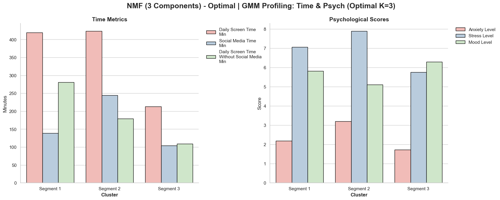</p>
<p align="center">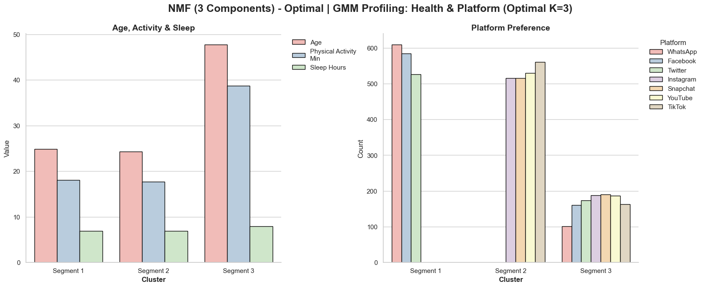</p>
<p align="center">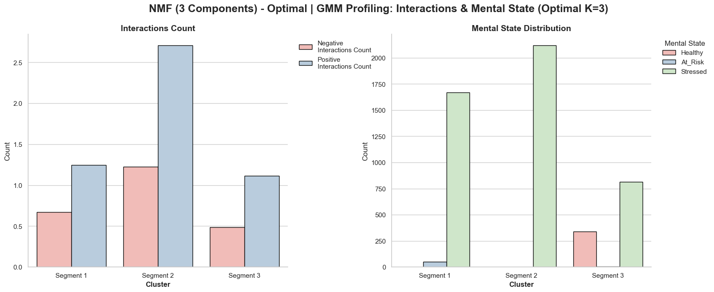</p>

---

## 🧠 Conclusions, limitations and future work

Back to the main question: *is a person's main platform and age linked to their anxiety or stress?* People don't simply vary along a scale of screen hours. They form **distinct lifestyle profiles**, and the way each platform works lines up with particular mental states. The results support our hypothesis:

| Conclusion | |
|---|---|
| 📈 **Screen time vs. mental strain** | Heavy daily screen time is clearly linked to severe mental strain. The "Heavy Social Media" group shows poor sleep and extreme anxiety scores |
| 🏗 **Platform design and mental strain** | Platform design matters as much as total screen time. Visual, algorithm-driven platforms (TikTok, Instagram) go with the most stress and anxiety. Functional apps (WhatsApp) go with better physical activity and sleep. *The type of digital engagement shapes mental health outcomes.* |
| 👵 **Age and platform preference** | Older users (average age about 48) prefer older platforms such as Facebook, have healthier offline habits and less screen time, and show much lower mental strain |

**Limitations**
- NMF needs non-negative input, so we could only use Min-Max scaling. Mean-centring and standard scaling were not possible.
- GMM is sensitive to its starting point and can get stuck in a local optimum.
- The classes are very unbalanced (92% *Stressed*).

**Future work**
- Try non-linear dimensionality reduction to capture more subtle behavioural structure.
- Add data collected over time to **follow people as they move between clusters**. This could find the turning point where a stable "Utility Screen" user slides into a high-risk "Heavy Social Media" state.

---

## 🗓 Project timeline

| Date | Milestone | Material |
|---|---|---|
| **17.5.26** | Dataset choice and EDA | The data set |
| **7.6.26** | Clustering milestone ("Advanced Clustering Techniques") | `clustering-7.6.26/` |
| **28.6.26** | ⭐ Final report and presentation | `Final project - 28.6.26/` |

**The second meeting (7.6.26) at a glance.** The full pipeline is in [`Clustering.ipynb`](clustering-7.6.26/Clustering.ipynb).
- Compared **Manual reduction** (Digital Habits vs. Mental Strain indexes + platform columns) with **PCA-2**.
  - On PCA-2, the Ward dendrogram has one dominant split at about 10 and a clear second split at about 6, which points to K = 3.
  - K-Means, Hierarchical and GMM all agree on 3 well-separated clusters.
  - DBSCAN over-splits the manual space (7 clusters) and under-splits PCA-2 (about 2 clusters).
- Silhouette at K = 3: Hierarchical with Ward linkage ≈ 0.34 (single linkage chains almost everything into one cluster); GMM with full covariance ≈ 0.35 (also the lowest BIC). → GMM was preferred because it gives a confidence probability for every point.
- The accompanying document ([`עותק של CLUSTERING`](clustering-7.6.26/)) answers the course's theory questions: unsupervised learning, distance measures, K-Means (assignment and update steps, spherical bias, local optima), hierarchical linkages and dendrograms, and DBSCAN. It also applies them to this project.

These results led to the final project: we moved from PCA to **NMF** and used **GMM** as the main algorithm.

---

## ▶ How to run

The notebook needs Python 3 and these packages:

```bash
pip install pandas scikit-learn scipy matplotlib seaborn jupyter
```

The notebook reads `Data.csv` from its working folder. This file is the **final (סופי)** tab of the dataset:

```bash
cp "The data set/csv-export/final (סופי).csv" clustering-7.6.26/Data.csv
jupyter notebook clustering-7.6.26/Clustering.ipynb
```

---

## 🇮🇱 תקציר בעברית

**השפעת הרשתות החברתיות על בריאות הנפש: ניתוח Clustering**
ורד שאולוב · אליה דבר · ליאב סמיה

בפרויקט בחנו אם הפלטפורמה העיקרית שבה אדם משתמש וגילו קשורים לרמות החרדה והלחץ שלו. הנתונים הם 5,000 שאלונים של 3,949 אנשים מהשנים 2024–2025, עם 15 מאפיינים.

**השיטה:** קידוד ונרמול (Min-Max), ואז הורדת ממדים. השווינו PCA עם 7 ועם 3 רכיבים, t-SNE ו-NMF. בסוף בחרנו ב-**NMF עם 3 רכיבים** ואחריו **GMM עם K=3** (Silhouette ≈ 0.50). בחרנו ב-GMM ולא ב-Hierarchical כי השיוך ההסתברותי שלו מתאים להתנהגות אנושית שאין לה גבולות חדים.

**שלושה פרופילים:**
- 🟦 **משתמש מסך "תועלתי"**: בן 25 בממוצע, הרבה זמן מסך אבל מעט רשתות. לחץ בינוני. WhatsApp ו-Twitter.
- 🟥 **משתמש רשתות כבד**: בן 24 בממוצע, הכי הרבה זמן ברשתות. הלחץ והחרדה הגבוהים ביותר. TikTok, Instagram ו-Snapchat.
- 🟩 **משתמש בריא עם שימוש דיגיטלי נמוך**: בן 48 בממוצע, ישן ומתאמן הכי הרבה. העומס הנפשי הנמוך ביותר.

**המסקנה המרכזית:** סוג הפלטפורמה חשוב לא פחות מכמות זמן המסך. פלטפורמות ויזואליות שמונעות על ידי אלגוריתם קשורות ליותר לחץ וחרדה, ואפליקציות תקשורת קשורות לאורח חיים בריא יותר.

---

<sub>All code, data, reports and presentations are the original project files and were not changed. The charts in `docs/figures/` were taken as-is from the final report and final presentation.</sub>
